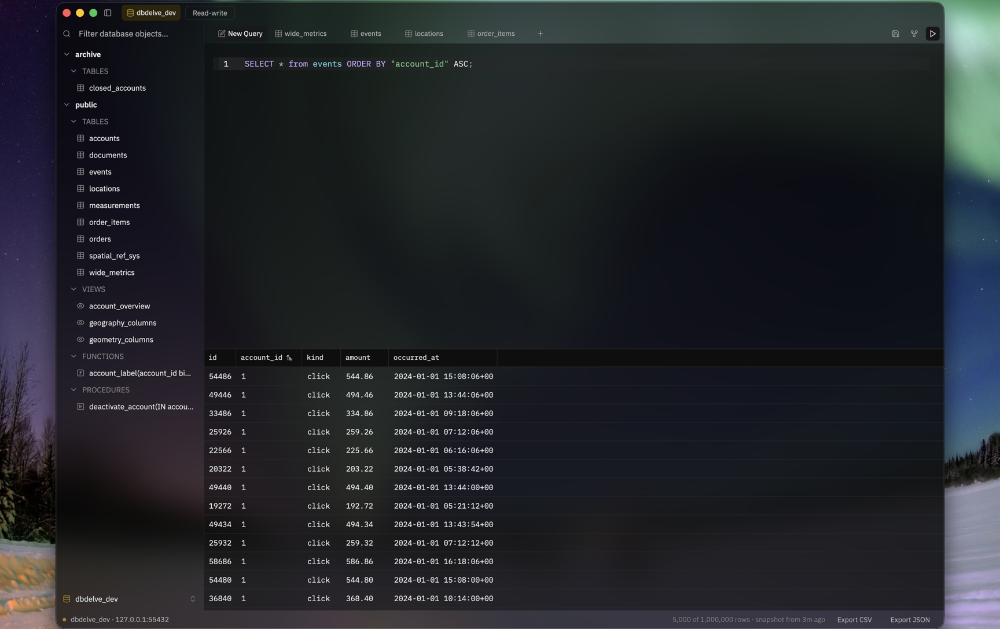

# DBDelve

A modern and performant database client for Postgres, MySQL and SQLite. MacOS only for now but linux is planned. Written in Rust
with GPUI. Buttery smooth, small memory footprint, fast navigation and stays performant on large datasets.

> Early days. Everything listed below works today.



A table of a million rows, scrolling at speed with quick tab switches.

https://github.com/user-attachments/assets/c24c98d9-6ab8-45c4-974b-96822b5a3042

## Why

I wanted something which is performant, modern and consumes little ram. The existing DB clients are either filled with bloat (Electron and JVM) or paid. This is an alternative to them. No feature is ever going behind a paywall and with time we will have complete parity on features with those too. 

## Supported databases

Postgres, MySQL and SQLite. More once these three are solid.

## What it does

- **Separate connections that stay separate.** Each one keeps its own tabs,
  schema tree and query history, so a buffer you wrote against staging can't
  quietly end up pointed at production. Passwords go in the Keychain, never
  into a config file.
- **Read-only, read-write and full access, per connection.** DBDelve won't send
  a statement your current mode doesn't allow, and it asks before anything
  destructive. Read-only also asks Postgres and MySQL to refuse writes on their
  end, as a second line. Neither replaces connecting as a role without write
  grants, which is the only real boundary.
- **In-line editing.** Arrow to a cell, Enter to edit it. Applying writes the
  `UPDATE` into the editor first, so you read it before it runs. A cell is only
  editable when DBDelve can identify its row by primary key; joins, views and
  keyless tables stay read-only and tell you why.
- **Sorting and filtering.** Clicking a header splices `ORDER BY` into the SQL
  you're looking at. Filter bars build the `WHERE` for you when you'd rather
  not type it.
- **Completion from your own schema.** The tables, columns, views and routines
  the connection actually has, not a generic keyword list. After `FROM` it
  offers relations; after a table or alias and a dot, that table's columns.
- **Export** whatever's in the grid to CSV or JSON. It writes what the tab
  already holds, no second query.
- **Keyboard-first.** Most actions ship with a chord and can be rebound in
  Settings. A handful of contextual ones, mainly sorting and filters, are still
  mouse-only.


## Installing

Apple Silicon, macOS 12 or later — that's what it's built and tested on. Intel
and older macOS aren't blocked by anything in the code, they're just untested.

Homebrew is the recommended way. It handles installing and upgrading, and
`brew upgrade` is the only thing that will ever tell you a new version exists:

```sh
brew install --cask ShayanAbbas1/dbdelve/dbdelve
```

macOS will refuse to open it the first time. DBDelve is signed ad-hoc: there's
no Developer ID behind it and nothing is notarized, so Gatekeeper declines.
Clearing the quarantine flag fixes this:

```sh
xattr -dr com.apple.quarantine /Applications/DBDelve.app
```

Once per install, not once per launch — but an update is a new install, so
you'll run it again after each one. Your connections and query history are kept
outside the app and survive. macOS will ask once more for the saved passwords in
your Keychain, because each release carries a different ad-hoc signature. I'll
pay for a Developer ID if enough people end up using this, which removes all of
the above.

Failing Homebrew, take the `.dmg` from [the latest release][releases] and drag
DBDelve to Applications. Same quarantine step and you have to update manually.

To build it yourself instead, `DBDELVE_CHANNEL=release dev/bundle.sh` produces
`target/DBDelve.app` with the release build, icon and signature. Drag that to
Applications; the quarantine step doesn't apply here.

[releases]: https://github.com/ShayanAbbas1/dbdelve/releases/latest

For discussions and ideas join the DBDelve discord server: https://discord.gg/upKpusAnS

## Updating

`brew upgrade --cask dbdelve`, if you installed it that way. Otherwise watch
[the releases page][releases]


## License

MIT. See [NOTICES.md](NOTICES.md) for third-party font licenses.
